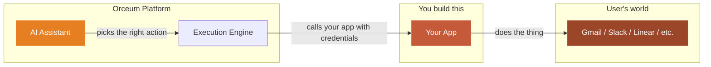

Orceum is a platform for AI assistants that actually do things. It handles intent, scheduling, credentials, and retries — your app provides the capability that connects the assistant to a real-world tool. Think of it the same way you'd think of iOS: iOS doesn't make phone calls, apps do. Orceum does the same thing for AI agents.

## What Orceum is

Think about how much time people spend on *work about work* — checking email, updating tasks, prepping for meetings, triaging Slack. Orceum takes that off their plate.

On Orceum, an AI assistant plugs into the tools people already use — Gmail, Slack, Calendar, Linear, X — and **actually operates them**. Not just "here's a summary." It drafts the reply, creates the task, posts the tweet, flags the urgent thread, and preps the brief before the 2pm call.

The key idea is **roles**. Users don't just chat with their assistant when they feel like it. They assign it standing responsibilities:

- *"You're my inbox manager — triage my email every morning at 8am."*
- *"You're my social media manager — draft posts from my notes every Tuesday."*
- *"You're my meeting prep assistant — brief me 30 minutes before every call."*

The assistant runs those responsibilities **on a schedule, without being asked**. That's what makes Orceum different from a chatbot wrapper.

<Note>
**Notion** is where your work lives. **Zapier** connects your tools. **Orceum does the work.**
</Note>

## Where you come in

The AI assistant is smart, but it doesn't have hands. It can't send an email by itself. It can't create a Linear ticket. It can't post to X.

**Your app gives it hands.**

When you build an app on Orceum, you're connecting a real-world tool — Gmail, Notion, your own SaaS product, anything with an API — to the platform. You tell Orceum: *"Here are the things I can do"* — and the assistant figures out when and how to call you.

It's the same relationship as iOS and apps. The assistant is the user's agent. Orceum is the operating system. Your app is the capability.



You don't need to worry about:

- Figuring out *what* the user wants — the assistant handles intent
- Storing credentials — Orceum encrypts and injects them at call time
- Retries, token refreshes, error recovery — Orceum handles that too
- Deciding *when* to act — roles and schedules are the platform's job

**You just build the bridge between Orceum and the tool.**

## Two ways your app gets called

<Tabs>
  <Tab title="On demand">
    A user says something like *"Draft a reply to the investor email that came in this morning."* The assistant figures out which app to call, what action to use, and what parameters to send.

    ```mermaid
    flowchart TD
        A(["User asks their assistant something"])
        B["Assistant identifies the right app + action"]
        C["Orceum resolves credentials & calls your app"]
        D["Your app does the thing"]
        E(["Assistant reports back to the user"])

        A --> B --> C --> D --> E

        style A fill:#e67e22,color:#fff,stroke:none
        style E fill:#c55a3a,color:#fff,stroke:none
    ```
  </Tab>
  <Tab title="Proactive / scheduled">
    No one asked. It's 8am. The user's "inbox manager" role wakes up. The assistant calls your Gmail app to pull unread emails, calls your Calendar app to check today's schedule, then compiles a morning brief.

    ```mermaid
    flowchart TD
        T(["8am — inbox manager role activates"])
        G["Gmail app — surfaces unread emails"]
        C["Calendar app — returns today's schedule"]
        O["Assistant triages, summarises, flags action items"]
        B(["User gets a morning brief — no prompt needed"])

        T --> G & C --> O --> B

        style T fill:#e67e22,color:#fff,stroke:none
        style B fill:#c55a3a,color:#fff,stroke:none
    ```
  </Tab>
</Tabs>

In both cases, **your app does the same thing**: receive a request, do the work, return the result. Orceum handles everything else.

## What you actually build

Building an app for Orceum is straightforward. There are four things to do:

<Steps>
  <Step title="Write a manifest">
    A manifest is a simple JSON description of what your app can do. You list your **actions** (like `send_email`, `create_task`, `get_unread`) along with their parameters and plain-English descriptions. Orceum reads this so the assistant understands your app's capabilities.
  </Step>
  <Step title="Register your app">
    One API call to Orceum. You send your app's endpoint URL, authentication config, and manifest. That's it — your app is now in the system.
  </Step>
  <Step title="Handle action calls">
    When the assistant decides to use your app, Orceum sends a `POST` request to your endpoint with a payload like:

    ```json
    {
      "event": "send_email",
      "event_data": {
        "to": "investor@example.com",
        "subject": "Re: Q2 Update",
        "body": "Thanks for the note. Here's the latest..."
      },
      "timestamp": "2026-04-15T08:30:00Z"
    }
    ```

    Your app executes the action and returns a JSON result. That's the core contract.
  </Step>
  <Step title="Push events (optional)">
    Something happened on your end? New email arrived, calendar invite updated, task completed? Push an event to Orceum and the assistant will decide what to do with it — notify the user, update a brief, trigger another action. Your app doesn't need to figure out the "what next" — Orceum does.
  </Step>
</Steps>

## Pick your app type

There are two ways to build an Orceum app — pick whichever fits your stack:

| Type | How it works | Best for |
|------|-------------|----------|
| **Native** | Orceum sends HTTPS `POST` requests to your endpoint | Any backend you control — Express, FastAPI, Rails, Lambda, anything |
| **MCP** | Your server implements the [Model Context Protocol](https://modelcontextprotocol.io) | If you already have an MCP tool server or want the standardised tool-calling spec |

Both types use the same manifest format and the same registration flow. The only difference is transport.

<Note>
There are also **System** and **Skill** app types, but those are internal to Orceum. As a third-party developer, you'll use **Native** or **MCP**.
</Note>

## Ready to build?

<CardGroup cols={2}>
  <Card title="Quick start" icon="bolt" href="/quickstart">
    Build and register your first app in under 10 minutes
  </Card>
  <Card title="App architecture" icon="grid-2" href="/building-apps/overview">
    Understand how apps, manifests, and actions fit together
  </Card>
</CardGroup>
